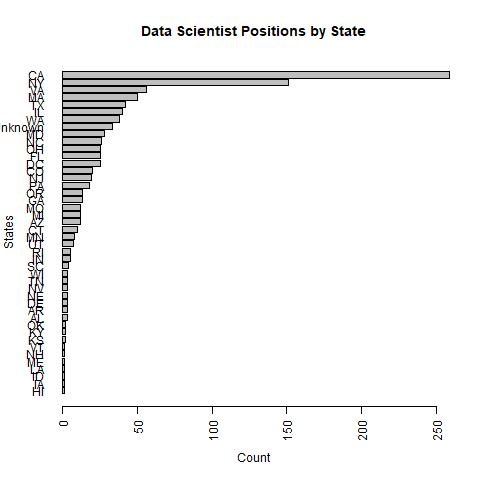
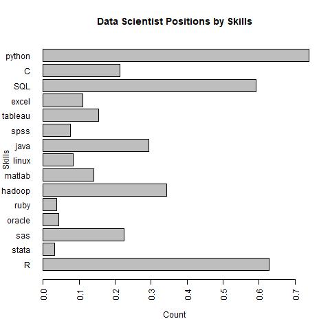

```{r setup, include=FALSE}
knitr::opts_chunk$set(echo = TRUE)
```

## Data Analysis Assignment 

Perform an analysis of "data scientist" jobs listed on job boards and on the employment pages of major companies. What are the most common skills that employers look for? What are the most unique skills that employers look for? Where are the types of companies that employ the most data scientists?

### Data source

All the data for this analysis was scraoed from Glassdoor.com. 

  * First, I get data, i.e., job  id, employer id, job title, salaries (if available), locations, employer from the search results for data scientist.
  * Next, using the job id from the search results in the previous step, I build the URL for the individual job posts on glassdoor and get the raw job descriptions which includes text information on qualifications which I will later query to build structured fields.
  * Finally, using the employer id from the search results, I build the URL for the employer page on glassdoor, and get the raw text from the employer description field, which includes things like, size, industry, year founded.

Overall, data for 990 job posts was scraped from the glassdoor website under the search term "data scientist" with no filter on location. These represent the job posts on the first 33 pages of results. 

###Job Locations

One of the fields scraped from the Glassdoor website was the job location, this information was missing for 33 of the 990 job posts. The bar plot belowe looks at the count of Job posts by state. The states with th most job posts include California, New York, followed by Virginia and Massachusetts. 

```{r}


```


### Job Skills

Using the raw text from the job and employer decsipription I created binary variables looking for text relevant skills specific to data scientists, e.g., R, SQL, and Python. Overall, 91.5% of the 990 job posts had at least 1 of the 15 skills that were investigated.

Overall, the most common skills are Python, SQL, and R. Some less common skills include Oracle, Ruby , and Stata.

```{r}


```

### Education

Using similar methods that were used to create the binary variables for the skills, we looked at the raw job descriptions for text describing education requirements for the job. Overall, 88.5% of job posts had some information specifying the level of edication required for the position. 54.2% of posts specified multiple levels of education, i.e., bachelors, masters, or PhD.

```{r}

knitr::include_graphics('education_barplot.jpg')


```

